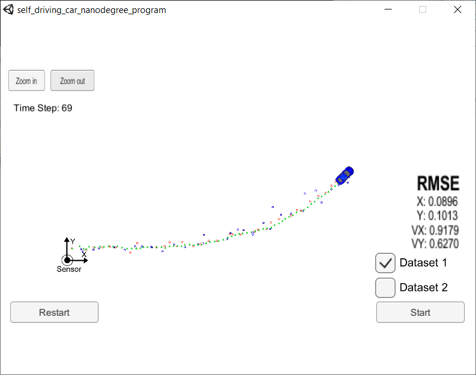

# Extended Kalman Filter

## _A project of Self-Driving Car Engineer Nanodegree_

  

### The goals / steps of this project are the following:
* Build a sensor fusion pipeline to track a moving object
* Implement [Extended Kalman Filter](https://en.wikipedia.org/wiki/Extended_Kalman_filter) in C++
* Estimate object's position and velocity with RADAR and LIDAR measurements
* Evaluate pipeline performance with RMSE

---

### Kalman Filter

Kalman Filter is commonly used for tracking a moving object, particularly in estimating its position and velocity. RADAR and LIDAR are two different types of sensors for a car to understand its surroundings. Due to their different characteristics in seeing the world, LIDAR is able to directly measuring the positions but not velocity with cloud points; while RADAR is able to directly measure both of the position and velocity using Doppler effect. RADAR often gives position information in low resolution, while LIDAR can do it with high accuracy. By combining the measurements from these two sensors, we can have better understanding of the tracked object.

- LIDAR measurements are red circles
- RADAR measurements are blue circles with an arrow pointing in the direction of the observed angle
- estimation markers are green triangles

### Estimation Pipeline

Kalman Filter involves two main steps, the prediction and the measurement update.
- LIDAR
  - A linear motion model is used to predict the object's position and velocity at the next time interval based on the current estimation.
  - Sensor measurements is used to correct the prediction from previous step, which gives us better estimation of the status of the object.
- RADAR
  - Since RADAR readings are in polar coordinates, when converting it to cartesian coordinates, the nonlinear transformation makes Kalman Filter no longer suitable.
  - First order Taylor expansion is used to linearise the transform, and this gives the Extended Kalman Filter.

### Demo Run

Here is a video recording to show how the sensor fusion pipeline work in simulator.

  

The pipeline and the simulator works in a host-client way. The simulator provides the pipeline the measured data (either LIDAR or RADAR), and the script feeds back the measured estimation marker, and RMSE values from its Kalman Filter.
